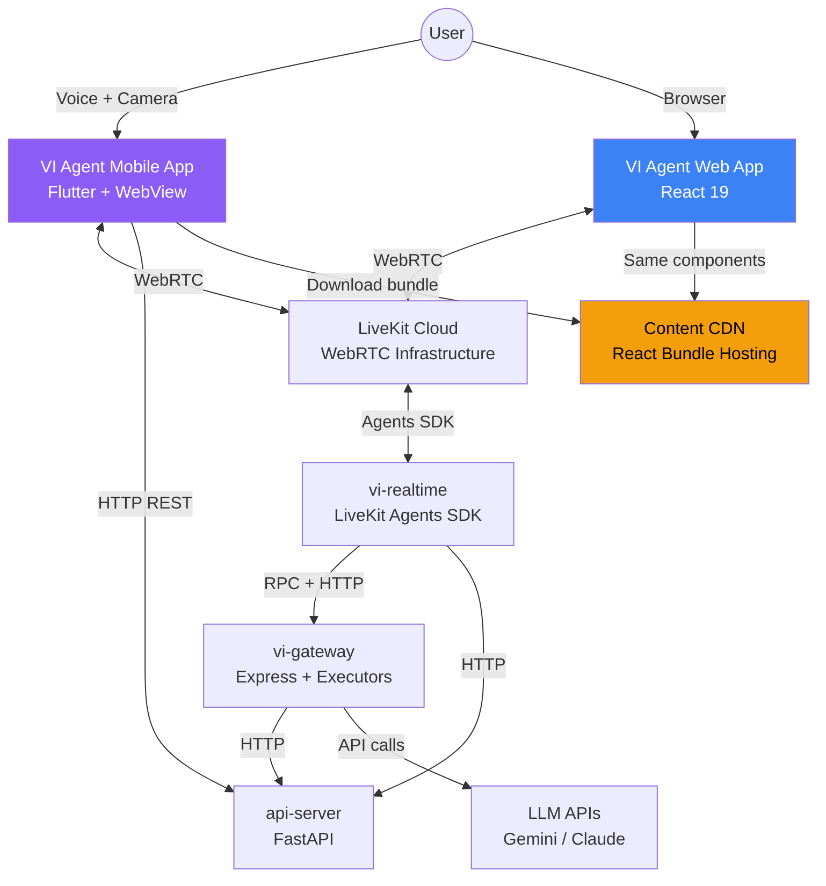
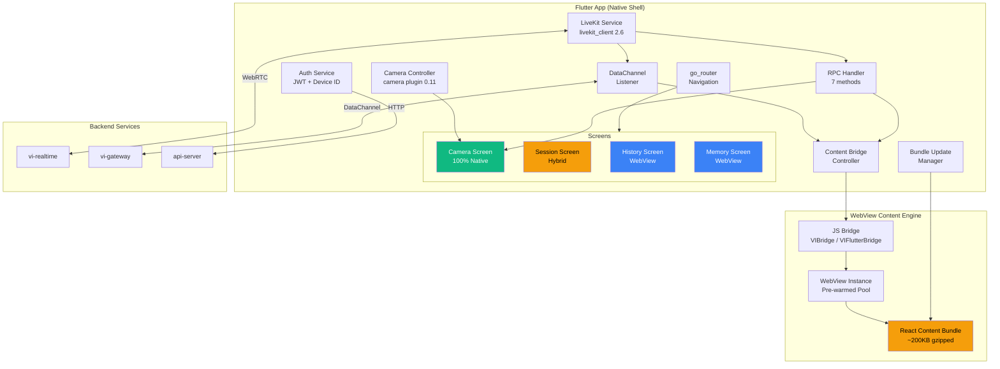
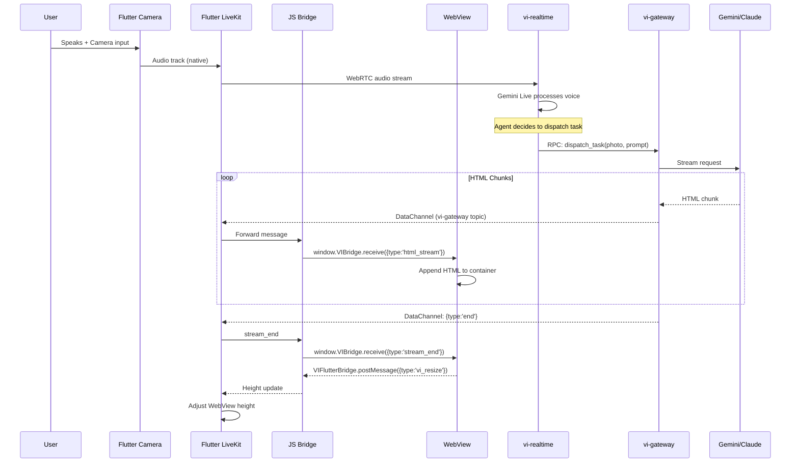
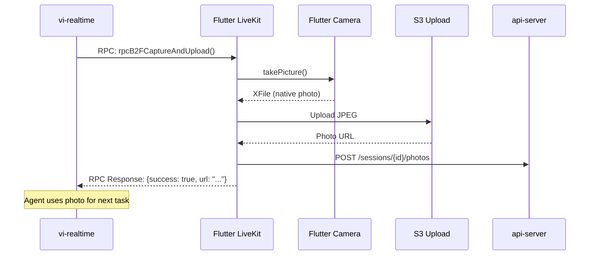
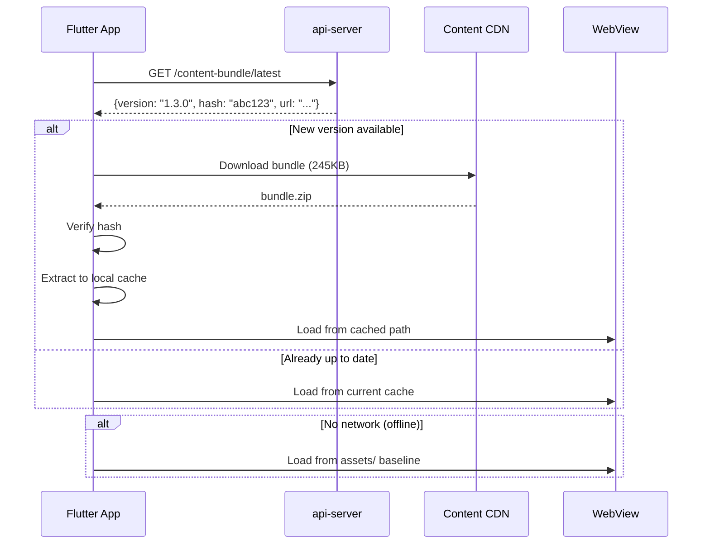
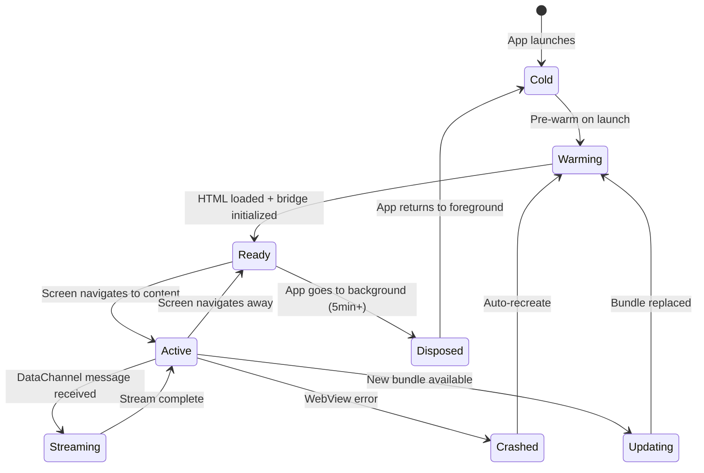
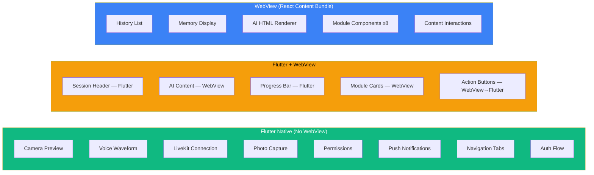

# VI Agent Mobile App — Architecture Diagrams

## C4 Level 1: System Context



## C4 Level 2: Container Diagram (Mobile App)



## Sequence: Voice → AI Response → App Display



## Sequence: Photo Capture via Agent RPC



## Sequence: Content Bundle Hot Update



## State: WebView Lifecycle



## Data Flow: Which Layer Handles What



## Monorepo Structure (Post-Migration)

```
vi_agent/
├── api-server/          # Backend (unchanged)
├── realtime/            # LiveKit Agent (unchanged)
├── gateway/             # Task Executor (unchanged)
│
├── frontend/            # Web + Mobile shared frontend
│   ├── src/
│   │   ├── app-web.jsx          # Web entry
│   │   ├── app-mobile.jsx       # Mobile entry (content only)
│   │   ├── components/          # SHARED components
│   │   │   ├── PersistentHtmlRenderer.jsx
│   │   │   ├── modules/         # 8 module types
│   │   │   ├── HistoryView.jsx
│   │   │   ├── MemoryView.jsx
│   │   │   └── shared.jsx       # Design system
│   │   ├── hooks/               # Web-only
│   │   └── mobile/              # Mobile bridge
│   │       ├── bridge.js
│   │       └── MobileBridgeProvider.jsx
│   ├── dist/
│   │   ├── web/                 # Web build output
│   │   └── mobile/              # Content Bundle output
│   └── vite.config.js
│
├── app/                 # Flutter mobile app
│   ├── lib/
│   │   ├── modules/pages/
│   │   │   ├── home/            # Camera screen (native)
│   │   │   ├── session/         # Session screen (hybrid)
│   │   │   ├── center/          # History (WebView)
│   │   │   └── memory/          # Memory (WebView)
│   │   ├── service/
│   │   │   ├── livekit/         # LiveKit native integration
│   │   │   ├── content_bridge/  # WebView bridge controller
│   │   │   └── bundle_manager/  # Content Bundle updates
│   │   └── widgets/
│   │       └── content_webview.dart  # Reusable WebView wrapper
│   ├── assets/
│   │   └── content-bundle/      # Baseline React bundle
│   ├── ios/
│   └── android/
│
├── docs/architecture/   # This document
├── dev.sh
└── docker-compose.yml
```
