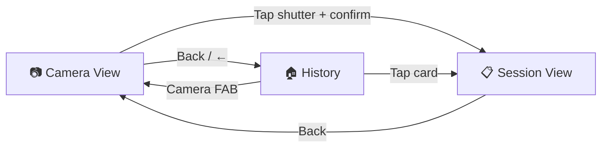
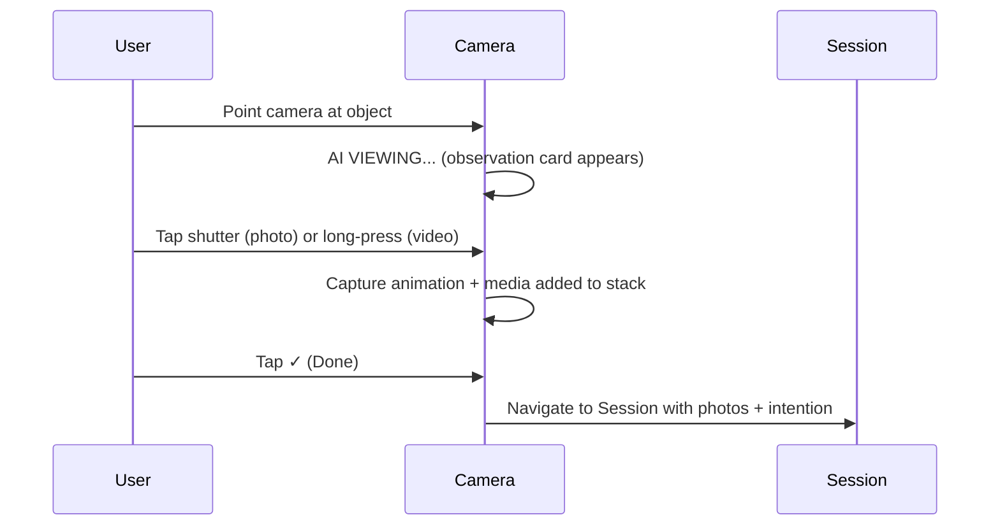
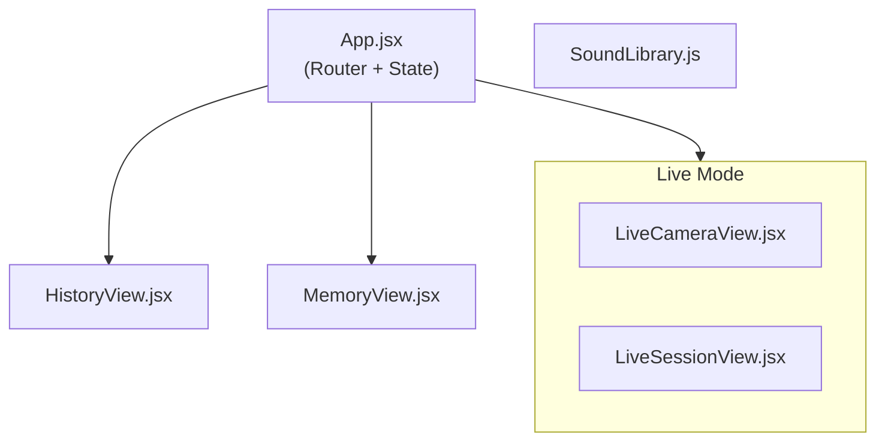

# VI-Agent Frontend — Product Documentation

> **Version:** V3 Frontend (Live Mode)
> **Last Updated:** March 2026
> **Status:** Live mode connected via LiveKit. Demo mode removed.

---

## 1. Product Vision

**Personal Intelligence in Your Camera** — a visual AI agent that lives in your camera, understands what you see, predicts what you need, and delivers structured artifacts in seconds.

### Core Axiom

```
Max Aggregated Effective Token Across the Whole System
```

Three growth levers:

1. **Max Effective Token Per Day Per User** — maximize the boundary of intelligence
2. **Max Daily Active User** — capture the largest entry point (the camera)
3. **Max System Run Time** — ensure User Value > Agent Salary > Agent Cost

### The Loop

```
Input [Visual + Intention] → Agent → Output [Artifact] → Grow [Memory, Skill]
```

Every interaction follows this loop. The camera is both input device and intelligence interface.

---

## 2. The Talking Camera

The central product innovation is the **Talking Camera** — a camera that sees, listens, and predicts simultaneously.

> **IMPORTANT:** The camera is not a shutter. It is a multi-modal input interface that combines **Vision + Voice + Gesture** into a single continuous interaction.

### Why It Matters

The V1.0 bottleneck was the **Intention Phase** — the only moment requiring the user to actively think and choose. The Talking Camera eliminates this by:

| Problem | Talking Camera Solution |
|---|---|
| Scene switching (scan → choose) breaks flow | Intention is collected **during** viewing via on-camera card |
| Open-ended "what do you want?" causes paralysis | System **predicts** intention; user only **confirms** |
| Voice/text input requires cognitive translation | Voice is captured naturally while viewing |

### Predictive Coding Model

Inspired by Karl Friston's Free Energy Principle:

```
P(Output) = P(Output | Visual) × P(Intention | Visual)
```

In most scenarios, `I(Output; Intention | Visual)` approaches zero — the visual input alone carries enough signal to predict the right action. The system only needs to collect the **residual** intention.

### Intention Hierarchy

```
L0: Domain       "food"
L1: Task type    "nutritional analysis"
L2: Specific     "calculate calories and macros"     ← System predicts to here
L3: Parameters   "compare to my daily target"
L4: Presentation "table format, dark background"
```

L0–L1 are inferred from visual affordances. **L2 is the prediction target** — specific enough to execute, not so specific as to over-constrain.

---

## 3. Design Principles

### Principle 1: Predict, Don't Ask

The system always makes a concrete prediction. It never asks "what do you want to do?"

```diff
- "What would you like to do with this photo?"
+ "Analyze nutritional content and calories →"
```

### Principle 2: Confirm, Don't Choose

Users face "is this right?" (confirmation), never "which is better?" (selection).

### Principle 3: Value Over Probability

When the visual signal is ambiguous, the system predicts the **highest-value** action, not the most probable one.

```
P(user wants) × V(action result) → maximize expected value
```

A low-probability but life-changing action (medication interaction check) beats a high-probability but low-value one (recognize brand name).

### Principle 4: Camera Time = Thinking Time

The camera viewing duration is not waiting time — it's the AI's processing time, converted into a natural moment for the user to frame their shot.

### Principle 5: Output is the Best Question

The first Artifact is the most efficient way to collect refined intent. Don't over-collect at input.

```
Input phase:  Collect L2 (basic-level intention)
Output phase: Use Artifact to probe L3/L4
```

### Principle 6: Context is Free Signal

Time, location, past sessions, and visual context are all free signals that reduce the need for explicit user input.

---

## 4. User Journey

The complete user journey flows through four screens:



---

### 4.1 Camera View — The Talking Camera

The primary interface. The user points the camera at something and the AI immediately begins analyzing.


#### Layout (top to bottom)

| Element | Description |
|---|---|
| **Back Arrow** (←) | Navigate to History/Home |
| **Signal Indicator** (WiFi icon) | Connection status: Connecting → Connected → Weak → Disconnected |
| **Flash Toggle** | OFF / ON flashlight control |
| **Reload** (↻) | Cycle to next demo use case |
| **Viewfinder** | Full-bleed camera feed (or demo background image) |
| **AI Status** | Cyan "AI VIEWING..." label with eye icon |
| **Observation Card** | Floating text showing the AI's real-time prediction |
| **Mic Button** | Left of shutter — muted mic with purple accent |
| **Shutter Button** | Center — tap for photo, long-press for video |
| **Done Button** | Right of shutter — green checkmark (appears after capture) |

#### The Observation Card

The floating card is the core innovation. It displays:

- **What the AI sees**: "Looks like a stack of receipts."
- **What the AI suggests**: "Should I tally them up, categorize them for your taxes, or sync them to QuickBooks?"
- **Keyword highlighting**: Key action words are bolded for scanability

#### Capture Flow



#### Media Stack

- Captured photos/videos stack as thumbnails above the shutter
- Show count badge ("1 items", "3 items")
- Supports gallery view with delete/clear-all

---

### 4.2 Session View — Processing & Delivery

After confirming, the user sees a structured breakdown of the AI's work.


#### Layout (top to bottom)

| Section | Description |
|---|---|
| **Header** | Title in "Input → Output" format (e.g., "Receipt → Tax Report") |
| **Image Carousel** | Horizontal scroll of captured photos with dot pagination |
| **WHAT I CAUGHT** | Two cards: Visual (what AI detected) + Voice (interpreted intent) |
| **MY WORK PLAN** | Expandable checklist of execution steps with ✓ completion |
| **HERE'S WHAT I MADE** | The final Artifact — a rich, interactive card |
| **Chat Input** | "Follow up..." text field with + button and purple send |

#### WHAT I CAUGHT Section

Two message-style cards:

1. **Visual card** (with thumbnail): "I see 3 receipts and invoices — a restaurant bill ($127.50), an office supply receipt ($84.32), and a hotel invoice ($459.00)."
2. **Voice card** (with waveform icon): "You need these recorded for tax filing. I'll extract every line item, categorize by IRS Schedule C, and prepare export-ready data."

#### Work Plan (Todos)

Each todo shows:

- Completion status (✓ green check or ○ pending)
- Task name (e.g., "Business Card OCR & Data Extraction")
- Substep detail (e.g., "ICS file ready — tap to add directly to iPhone Calendar")

#### Artifact Display

The "HERE'S WHAT I MADE" section contains the final output — a rich, interactive card specific to the use case type. Example for Card → Meeting:


This artifact includes:

- **Calendar Event**: "Meeting with Sarah Chen" with date/time
- **Contact Extracted**: Full vCard (name, title, company, email, phone, LinkedIn)
- **AI Action Item**: "Follow-up Coffee Chat" with suggested time and location

---

### 4.3 History View — Memory & Re-engagement

The home screen showing all past sessions as a visual gallery.


#### Layout

| Element | Description |
|---|---|
| **"History" Header** | Large typography with profile icon (top-right) |
| **Search Bar** | "Search memories..." with magnifying glass |
| **Session Grid** | 2-column card layout with thumbnails |
| **Camera FAB** | Floating camera button (bottom-right) |

#### Session Cards

Each card shows:

- **Thumbnail**: The original captured image
- **Title**: "Input → Output" format (e.g., "Board → Action Items")
- **Summary**: One-line description of what was done
- **Timestamp**: Relative time ("Today", "3 days ago", "Last week")

Tapping a card opens the full Session View with expanded artifact.

---

### 4.4 Live Mode — Real-Time AI

When accessed without `?demo`, the app connects to a LiveKit server for real-time visual AI processing.


#### Differences from Demo Mode

| Feature | Demo Mode | Live Mode |
|---|---|---|
| Camera feed | Static background image per use case | Real device camera via LiveKit |
| AI processing | Pre-scripted responses (removed) | Real-time AI via LiveKit Agent |
| Connection | Always "connected" | Real connection states |
| Mic | Visual only | Actual audio capture + transmission |
| Status badge | None | "AI OFFLINE" / "AI ONLINE" |

---

## 5. Architecture

### Technology Stack

| Layer | Technology |
|---|---|
| Framework | Vite + React |
| Styling | Vanilla CSS |
| Animation | Framer Motion |
| Real-time | LiveKit Client SDK |
| Icons | Lucide React |
| Audio | Custom SoundLibrary.js |

### Component Map



### Routing Logic

```javascript
// View states
'camera'       → LiveCameraView
'session'      → LiveSessionView
'history'      → HistoryView
```

---

## 6. Artifacts

In live mode, the agent generates HTML artifacts dynamically via the gateway. These are rendered by `PersistentHtmlRenderer.jsx` within `LiveSessionView.jsx`.

---

## 7. Sound Design

The app uses a custom `SoundLibrary.js` (`frontend/src/sounds/`) with contextual audio feedback:

| Event | When |
|---|---|
| Signal | Connection state changes |
| Flashlight | Flash toggle on/off |
| Flip | Camera flip front/back |
| Delete | Media stack item removed |
| Shutter | Photo captured |
| Recording start/stop | Video recording states |

---

## 8. Authentication

Authentication is handled via `useAuth` hook with JWT tokens. The login/signup flow is embedded in the main app.

---

## 9. Product Roadmap Context

Based on the [Overall Product Strategy](../../design%20doc/Visual%20Intelligence%20Overall%20Product%20Strategy.md) and [PRD V1.2](../../design%20doc/VI%20PRD%20V1.2.md):

| Version | Focus | Status |
|---|---|---|
| **V0.9** | Base Loop with Experimental Talking Camera | ✅ Completed |
| **V1.0** | Base Loop with Traditional Camera + Temp Artifacts | ✅ Implemented (current frontend) |
| **V1.1** | Routine Artifacts + Plugin System | 🔜 Planned |
| **V1.2** | Memory, Skill, Use Case Discovery | 🔜 Planned |
| **V2.0** | Live Stream + Real-time processing | 🔜 In progress (LiveKit integration) |

### Agent Economics

| Item | Detail |
|---|---|
| **Monthly Salary** | $20 base |
| **Bonus** | Pay for token credit, no upper limit |
| **Cost per Loop** | ~$0.02–0.08 |
| **Monthly (10 loops/day)** | ~$6–24 |
| **Models** | Gemini Live (real-time), Gemini Flash (fast), Claude Opus 4.6 (high-end), Kimi K2.5 (cheap) |

---

## 10. Key Source Files

| File | Purpose |
|---|---|
| `frontend/src/App.jsx` | Main router — auth state, view transitions |
| `frontend/src/components/LiveCameraView.jsx` | Live camera — LiveKit integration, real mic/camera, backend dispatch |
| `frontend/src/components/LiveSessionView.jsx` | Live session — real-time results from LiveKit Agent |
| `frontend/src/components/HistoryView.jsx` | History/Home — session grid, search, profile, camera FAB |
| `frontend/src/components/MemoryView.jsx` | Memory management UI |
| `frontend/src/components/PersistentHtmlRenderer.jsx` | HTML artifact renderer |
| `frontend/src/sounds/` | Sound effects manager — contextual audio feedback |
